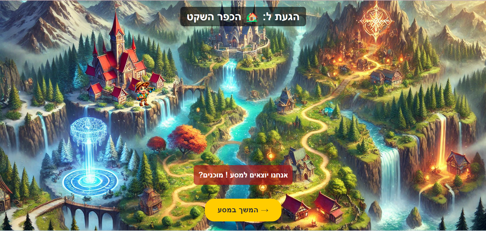
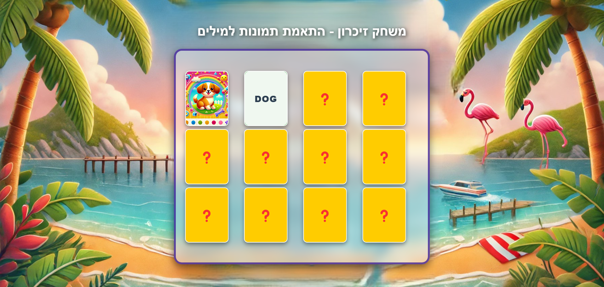

# 🎮 פלטפורמה ללימוד אנגלית

דרך מהנה ואינטראקטיבית ללימוד אנגלית באמצעות משחקים מרתקים! 🌟

## 🚀 על הפלטפורמה

**English Learning Platform** מציעה חוויית למידה מרתקת לילדים באמצעות משחקים אינטראקטיביים ומהנים. הפלטפורמה כוללת כיום **שני משחקים**, כאשר **משחק ההרפתקה** הוא גולת הכותרת!

## 🎯 המשחקים בפלטפורמה

### 🏆 משחק ההרפתקה - מסע הלמידה האולטימטיבי

המשחק המרכזי בפלטפורמה! אתם יוצאים למסע מרגש בעולם פנטזיה מלא הרפתקאות ואתגרים. בכל שלב תגלו מקומות קסומים חדשים, תענו על שאלות, ותתקדמו במסלול עד שתגיעו לשער הניצחון!

#### 🔹 בחירת דמות למשחק
בחרו את הדמות שלכם וצאו למסע:


#### 🔹 בחירת רמת הקושי
התאימו את החוויה לרמה שלכם:


#### 🔹 חקרו עולמות קסומים
נווטו בין תחנות שונות במפה:


#### 🔹 פתרו חידות ושאלות באנגלית
ענו נכון כדי להתקדם במסע:


#### 🔹 סיימו את המסע והגיעו לשער הניצחון
הוכיחו את הידע שלכם וסיימו בהצלחה!


---

### 🃏 משחק הזיכרון - התאמת מילים לתמונות

משחק מהנה שמפתח את הזיכרון והאוצר המילים באנגלית! עליכם למצוא את הזוגות הנכונים - מילה באנגלית ותמונה תואמת.

#### 🔹 מטרת המשחק
התאימו מילים לתמונות וזכרו את המיקומים:


---

### 🎲 בקרוב - משחק שלישי!

משחק **חדש ומלהיב** נמצא בפיתוח! הישארו מעודכנים לעדכונים הבאים! 🚀

## 🌍 שחקו עכשיו!

👉 **[לחצו כאן כדי לשחק](https://miriametel.github.io/English-Learning-Platform/)**

## ⭐ תומכים בפרויקט

אם אהבתם את הפרויקט, ככבו אותו ⭐ בגיטהאב כדי לתמוך בו!

## 🛠️ התקנה (למפתחים)

```sh
# שכפול הריפוזיטורי
git clone https://github.com/MiriamEtel/English-Learning-Platform.git
cd English-Learning-Platform

# התקנת חבילות נדרשות
npm install

# הרצה מקומית
npm start
```

## 🤝 תרומות לקוד

נשמח לקבל תרומות קוד! תוכלו לשלוח Pull Requests או לדווח על באגים לשיפור הפרויקט.

---

🌟 **הצטרפו למסע והפכו את לימוד האנגלית לחוויה מרגשת!**

