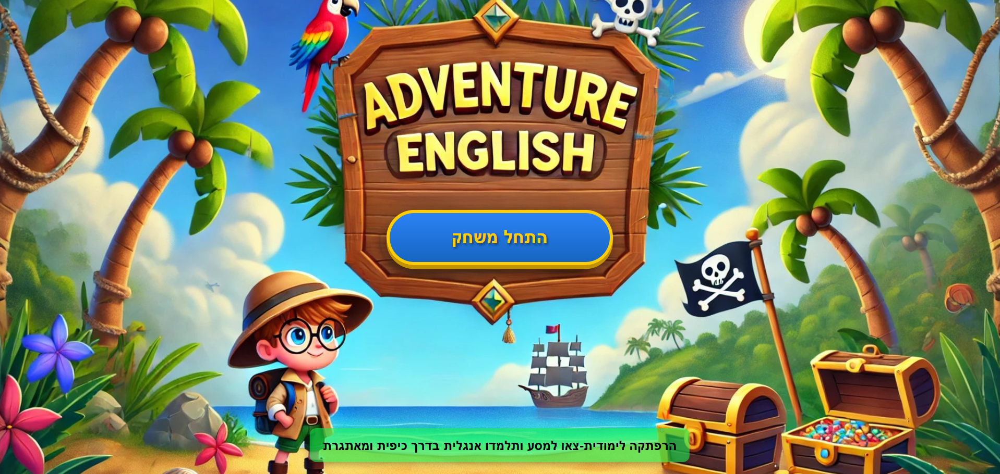
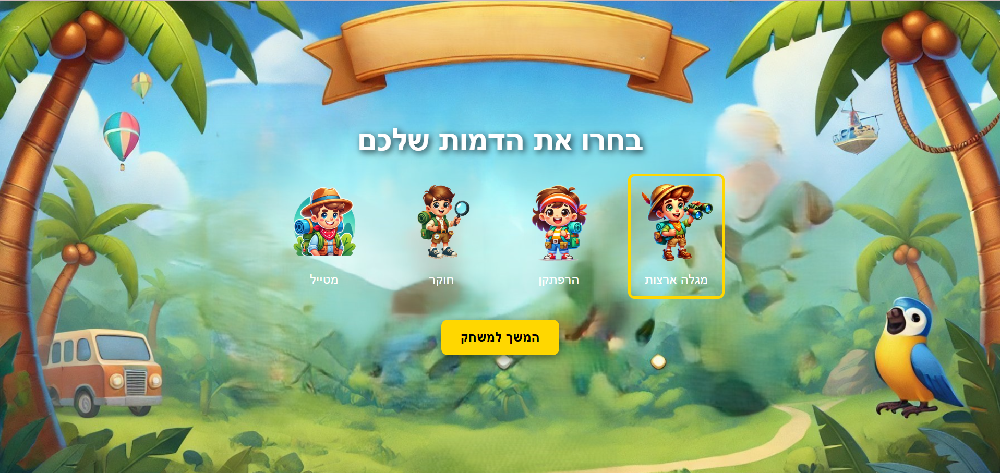
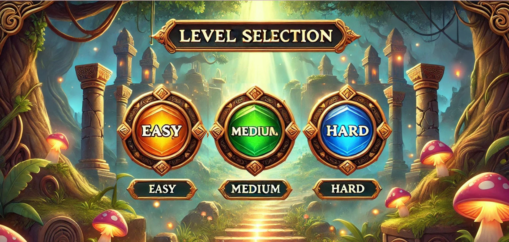
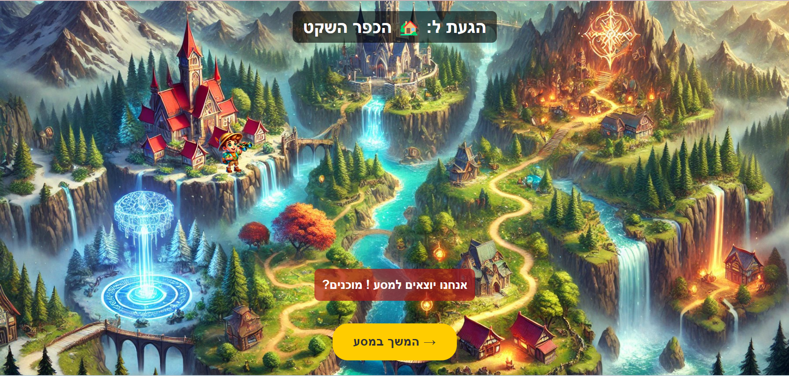
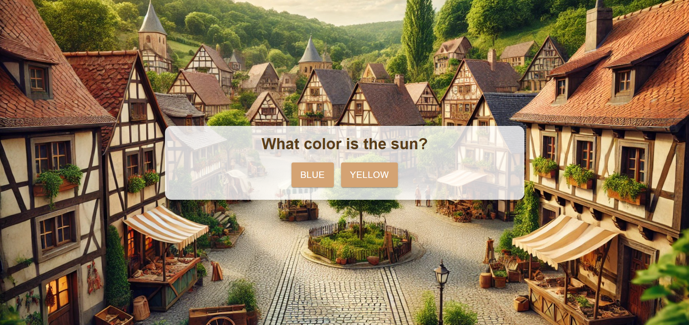
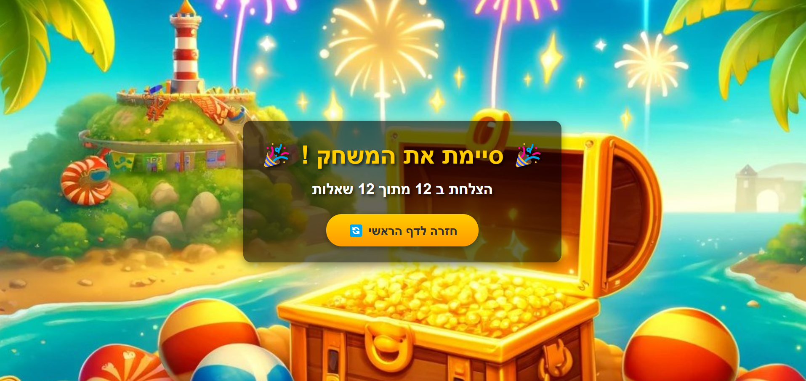
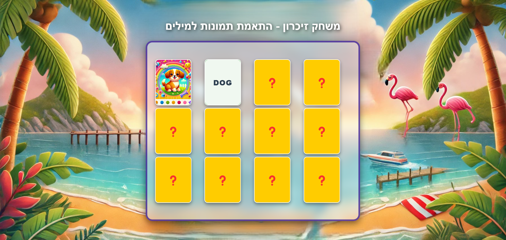

# 🎮 English Learning Platform

A fun and interactive way to learn English through exciting games! 🌟

👉 **[Click here to play](https://miriametel.github.io/English-Learning-Platform/)**

## 🚀 About the Platform

**English Learning Platform** provides an engaging learning experience for children through interactive and enjoyable games. The platform currently includes **two games**, with **Adventure Game** being the highlight!

## 🎯 Games on the Platform

### 🏆 Adventure Game - The Ultimate Learning Journey

The main game on the platform! Embark on an exciting journey through a fantasy world full of adventures and challenges. In each stage, you will explore magical locations, answer questions, and progress along the path until you reach the victory gate!



#### 🔹 Choose Your Character
Select your character and begin your journey:



#### 🔹 Choose Difficulty Level
Adjust the experience to your skill level:



#### 🔹 Explore Magical Worlds
Navigate through different locations on the map:



#### 🔹 Solve English Challenges
Answer correctly to advance in the journey:



#### 🔹 Reach the Victory Gate
Prove your knowledge and complete the journey successfully!



---

### 🃏 Memory Game - Matching Words to Images

A fun game that enhances memory and English vocabulary! Match the correct pairs - an English word with its corresponding image.

#### 🔹 Game Objective
Match words with images and remember their locations:



---

### 🎲 Coming Soon - A Third Game!

A **new and exciting** game is in development! Stay tuned for future updates! 🚀

## 🌍 Play Now!

👉 **[Click here to play](https://miriametel.github.io/English-Learning-Platform/)**

## ⭐ Support the Project

If you enjoyed the project, give it a ⭐ on GitHub to support it!

## 🛠️ Installation 

```sh
# Clone the repository
git clone https://github.com/MiriamEtel/English-Learning-Platform.git
cd English-Learning-Platform

# Install dependencies
npm install

# Run locally
npm start
```

## 🤝 Contribute to the Code

We welcome code contributions! You can submit pull requests or report bugs to improve the project.

---

🌟 **Join the journey and make learning English an exciting adventure!**


--

# 🎮 פלטפורמה ללימוד אנגלית

דרך מהנה ואינטראקטיבית ללימוד אנגלית באמצעות משחקים מרתקים! 🌟

 **[לחצו כאן כדי לשחק](https://miriametel.github.io/English-Learning-Platform/)**

## 🚀 על הפלטפורמה

**English Learning Platform** מציעה חוויית למידה מרתקת לילדים באמצעות משחקים אינטראקטיביים ומהנים. הפלטפורמה כוללת כיום **שני משחקים**, כאשר **משחק ההרפתקה** הוא גולת הכותרת!

## 🎯 המשחקים בפלטפורמה

### 🏆 משחק ההרפתקה - מסע הלמידה האולטימטיבי

המשחק המרכזי בפלטפורמה! אתם יוצאים למסע מרגש בעולם פנטזיה מלא הרפתקאות ואתגרים. בכל שלב תגלו מקומות קסומים חדשים, תענו על שאלות, ותתקדמו במסלול עד שתגיעו לשער הניצחון!


#### 🔹 בחירת דמות למשחק
בחרו את הדמות שלכם וצאו למסע:


#### 🔹 בחירת רמת הקושי
התאימו את החוויה לרמה שלכם:


#### 🔹 חקרו עולמות קסומים
נווטו בין תחנות שונות במפה:


#### 🔹 פתרו חידות ושאלות באנגלית
ענו נכון כדי להתקדם במסע:


#### 🔹 סיימו את המסע והגיעו לשער הניצחון
הוכיחו את הידע שלכם וסיימו בהצלחה!


---

### 🃏 משחק הזיכרון - התאמת מילים לתמונות

משחק מהנה שמפתח את הזיכרון והאוצר המילים באנגלית! עליכם למצוא את הזוגות הנכונים - מילה באנגלית ותמונה תואמת.

#### 🔹 מטרת המשחק
התאימו מילים לתמונות וזכרו את המיקומים:


---

### 🎲 בקרוב - משחק שלישי!

משחק **חדש ומלהיב** נמצא בפיתוח! הישארו מעודכנים לעדכונים הבאים! 🚀

## 🌍 שחקו עכשיו!

👉 **[לחצו כאן כדי לשחק](https://miriametel.github.io/English-Learning-Platform/)**

## ⭐ תומכים בפרויקט

אם אהבתם את הפרויקט, ככבו אותו ⭐ בגיטהאב כדי לתמוך בו!

## 🛠️ התקנה 

```sh
# שכפול הריפוזיטורי
git clone https://github.com/MiriamEtel/English-Learning-Platform.git
cd English-Learning-Platform

# התקנת חבילות נדרשות
npm install

# הרצה מקומית
npm start
```

## 🤝 תרומות לקוד

נשמח לקבל תרומות קוד! תוכלו לשלוח Pull Requests או לדווח על באגים לשיפור הפרויקט.

---

🌟 **הצטרפו למסע והפכו את לימוד האנגלית לחוויה מרגשת!**

